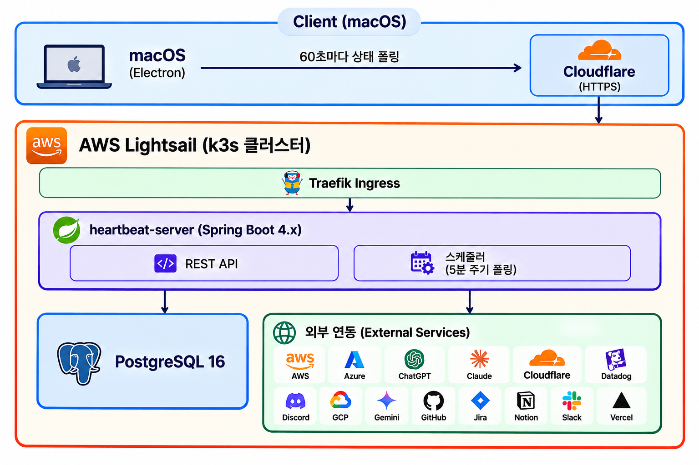
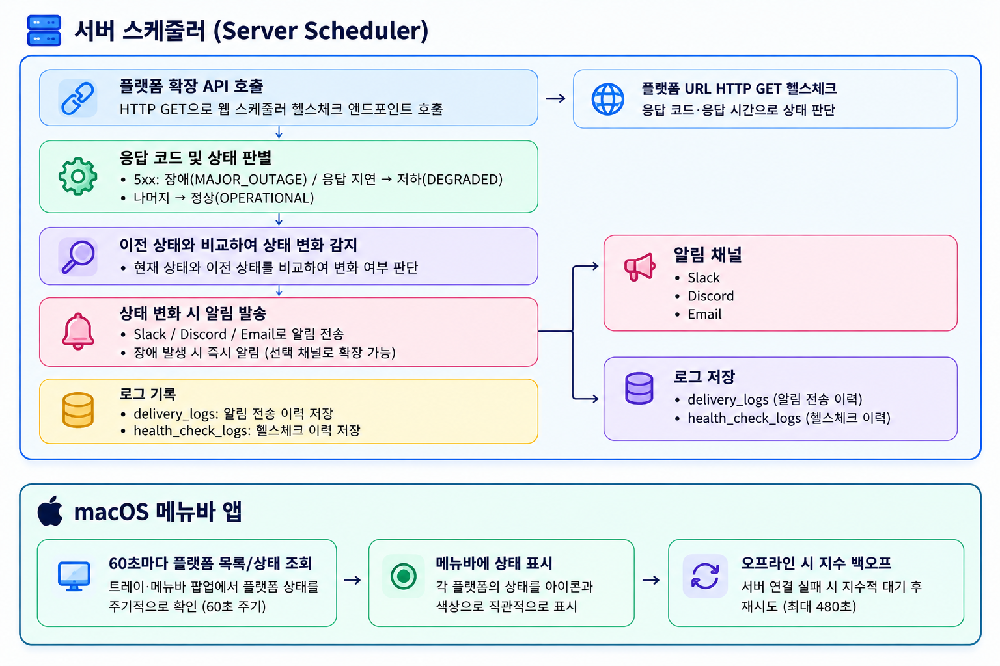
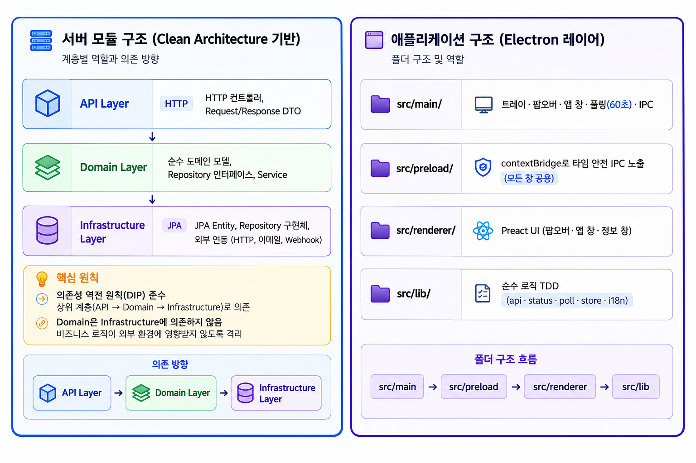

<div align="center">
  <h1>Heartbeat</h1>
  <p>구독한 서비스의 상태를 macOS 메뉴바(노치)에서 한눈에 보는 앱</p>
</div>

> 앱 코드가 궁금하다면? → [`heartbeat-app`](https://github.com/NEXTDV/heartbeat-app)

백엔드(`https://heartbeat.chapchu.site`)가 수집하는 외부 서비스(Claude·AWS·Slack·GitHub 등)의
헬스체크 상태를, 원하는 서비스만 구독해 메뉴바 팝오버와 앱 창에서 확인한다.

## 설치

**요구사항**: macOS Apple Silicon(arm64). Homebrew 한 줄:

```bash
brew install --cask nextdv/tap/heartbeat
```

업데이트: `brew upgrade --cask heartbeat`

> 미서명 앱이라 **첫 실행 시** Gatekeeper 경고가 뜬다 → `/Applications/Heartbeat.app`을
> **우클릭 → 열기**를 한 번 해주면 이후로는 그냥 열린다.
> (또는 `xattr -dr com.apple.quarantine "/Applications/Heartbeat.app"`)

## 기능

- **메뉴바 상주** — dock 없이 노치에 아이콘으로 상주. 아이콘은 항상 즉시 생성되고, **첫 실행 시엔 앱 창**을 띄운다.
- **세 화면**
  - **팝오버** — 메뉴바 아이콘 클릭. 구독한 서비스 상태를 빠르게 확인.
  - **앱 창** — 트레이 "앱 열기" 또는 팝오버 "앱 열기". 전체 서비스 구독 관리 + 상세.
  - **정보(About)** — 트레이 "정보" 또는 앱 창 footer "정보". 버전·업데이트 확인·후원·언어 설정.
- **트레이 우클릭 메뉴** — 앱 열기 / 정보 / 앱 종료.
- **구독** — 전체 플랫폼 목록에서 토글로 구독. 구독은 로컬(electron-store)에 저장되며 창 간 실시간 동기화된다.
- **상태 폴링** — 구독한 플랫폼의 상태(정상·저하·장애 · 응답시간 · 상대시간)를 주기적으로 갱신. 오프라인 시 배지 표시.
- **다국어** — 한국어 · English · 日本語 · 中文. 기본은 시스템 로케일, 정보 화면에서 수동 전환(설정 저장).

계정·로그인은 없다(상태 조회는 무인증, 구독은 로컬 전용).

## 동작 방식 (API 호출 기준)

대상 서버 `https://heartbeat.chapchu.site` (무인증).

| 엔드포인트 | 언제 |
|---|---|
| `GET /platforms` | 폴링 1회마다(플랫폼 메타) + "모든 서비스" 목록 표시 시 |
| `GET /platforms/{id}/status` | 폴링마다 **구독한 플랫폼 각각** |

- **주기**: 기본 **60초**. 실행 즉시 1회 → 이후 60초 간격.
- **즉시 새로고침**: 팝오버·앱 창 열 때, 구독 추가/해제 시, 수동 새로고침 버튼.
- **구독이 없으면 상태 호출 0** (빈 폴링, 네트워크 미사용).
- **한 번의 폴링** = `/platforms` 1회 + `/status` × (구독 수), **병렬** 실행.
- **실패 처리**: 개별 플랫폼 실패 → 해당 서비스만 `UNKNOWN`. 전체 실패(오프라인) → 오프라인 표시 + **지수 백오프**(간격 × 2^연속실패, 상한 480초). 진행 중이면 중복 폴링 방지.

### 서버 판정 방식

서버는 60초마다 등록된 플랫폼에 HTTP 요청을 보내 응답 시간과 상태 코드를 기록합니다.

| 상태 | 판정 기준 |
|---|---|
| `OPERATIONAL` | 정상 응답, 응답 시간이 임계값 이내 |
| `DEGRADED` | 응답은 성공했으나 응답 시간이 임계값 초과 |
| `MAJOR_OUTAGE` | HTTP 500 이상 또는 연결 실패 |







## 서버 API

앱이 사용하는 상태 데이터를 제공하는 백엔드입니다.

- **Live API**: https://heartbeat.chapchu.site
- **Swagger UI**: https://heartbeat.chapchu.site/swagger-ui/index.html

### 현재 제공

| Method | Endpoint | 설명 |
|---|---|---|
| `GET` | `/platforms` | 플랫폼 목록 |
| `GET` | `/platforms/{id}` | 플랫폼 단건 조회 |
| `GET` | `/platforms/{id}/status` | 최신 헬스체크 상태 |
| `GET` | `/platforms/{id}/logs` | 헬스체크 로그 목록 |
| `GET` | `/health` | 서버 상태 |

### 다음 버전 예정

| Method | Endpoint | 설명 |
|---|---|---|
| `POST` / `GET` / `DELETE` | `/channels` | 알림 채널 등록 / 조회 / 삭제 |
| `POST` | `/channel-platforms` | 플랫폼 구독 |
| `GET` | `/accounts` | 계정 조회 |

## 한계 · 주의

- **구독은 로컬 전용** — 백엔드에 구독 read-back API가 없어 electron-store에만 저장. **재설치·기기 변경 시 구독은 초기화**된다.
- **무인증** — 대회용 백엔드라 인증이 없다.
- **미서명(Phase 0)** — 코드 서명·notarization 미적용(첫 실행 Gatekeeper 안내 참고). 공개 승격 시 서명 도입 대상.
- **플랫폼 데이터는 DB 의존** — 운영 서버 DB에 등록된 플랫폼만 앱에 노출된다.
- **이메일 발송 부분 구현** — 알림 이메일 발송은 일부만 구현된 상태다.

## 스택

앱은 `package.json` 기준 (앱 버전 `0.1.6`).

| 영역 | 기술 | 버전 | 라이선스 | 저장소 |
|---|---|---|---|---|
| 런타임 | Node.js | `24.x` | MIT | https://github.com/nodejs/node |
| 패키지 매니저 | pnpm | `11.7.0` | MIT | https://github.com/pnpm/pnpm |
| 언어 | TypeScript(strict) | `^7.0.2` | Apache-2.0 | https://github.com/microsoft/TypeScript |
| 앱 셸 | Electron | `^43.4.0` | MIT | https://github.com/electron/electron |
| 빌드 | electron-vite | `^5.0.0` | MIT | https://github.com/alex8088/electron-vite |
| UI | Preact | `^10.29.8` | MIT | https://github.com/preactjs/preact |
| 스타일 | Tailwind CSS | `^4.3.3` | MIT | https://github.com/tailwindlabs/tailwindcss |
| 스타일 | daisyUI | `^5.7.17` | MIT | https://github.com/saadeghi/daisyui |
| 상태 저장 | electron-store | `^11.0.2` | MIT | https://github.com/sindresorhus/electron-store |
| 테스트 | Vitest | `^4.1.10` | MIT | https://github.com/vitest-dev/vitest |
| 린트/포맷 | Biome | `^2.5.8` | MIT | https://github.com/biomejs/biome |
| 패키징 | electron-builder | `^26.15.3` | MIT | https://github.com/electron-userland/electron-builder |
| 서버 언어 | Java | `25` | GPLv2+CE | https://github.com/openjdk/jdk |
| 서버 프레임워크 | Spring Boot | `4.1.0` | Apache-2.0 | https://github.com/spring-projects/spring-boot |
| DB | PostgreSQL | — | PostgreSQL | https://github.com/postgres/postgres |
| 배포 | k3s on AWS Lightsail | — | Apache-2.0 | https://github.com/k3s-io/k3s |
| CI/CD | GitHub Actions | — | — | https://github.com/features/actions |

## 팀

- **이정범** — Spring Boot API, AWS Lightsail(k3s) 인프라
- **이진우** — macOS 메뉴바 앱([`heartbeat-app`](https://github.com/NEXTDV/heartbeat-app))

## 라이선스

[MIT](./LICENSE) © 2026 NEXTDV
