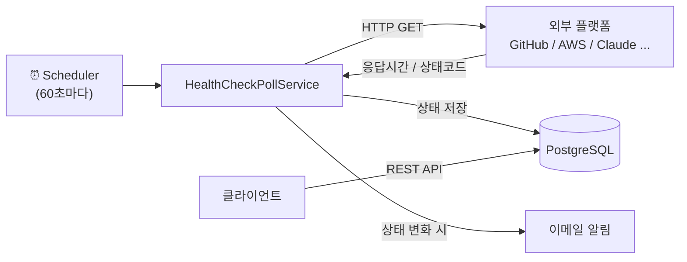

# Heartbeat

> 개발자와 인프라 엔지니어를 위한 경량 서비스 상태 모니터링 도구

복잡한 설정 없이 주요 플랫폼(GitHub, AWS, Claude 등)의 장애를 빠르게 감지하고 알림을 받을 수 있습니다.
`application.yml` 파일 하나로 모니터링 대상을 자유롭게 커스텀할 수 있습니다.

---

## 주요 기능

- **자동 헬스체크**: 설정된 플랫폼을 60초마다 폴링하여 상태 기록
- **상태 분류**: `OPERATIONAL` / `DEGRADED` / `MAJOR_OUTAGE` 3단계 판정
- **이메일 알림**: 상태 변화 감지 시 구독된 채널로 즉시 발송
- **커스텀 플랫폼**: `application.yml`에 모니터링 대상을 직접 정의
- **REST API**: 플랫폼 상태 조회, 알림 채널 등록/삭제

---

## 아키텍처



| 구분 | 기술 |
|---|---|
| Language | Java 25 |
| Framework | Spring Boot 4.x (multi-module) |
| DB | PostgreSQL |
| 배포 | k3s on AWS Lightsail |
| CI/CD | GitHub Actions |

---

## 로컬 실행

**사전 요구사항**: Java 25, Docker

```bash
# 1. PostgreSQL 실행
docker-compose up -d

# 2. 서버 실행
./gradlew :api:bootRun
```

Swagger UI: `http://localhost:8080/swagger-ui/index.html`

---

## 플랫폼 커스텀

`application.yml`에 모니터링할 플랫폼을 직접 정의할 수 있습니다.

```yaml
heartbeat:
  platforms:
    - name: 우리 회사 API
      category: OTHER
      healthCheckUrl: https://api.mycompany.com/health
      timeoutMs: 5000
      degradedThresholdMs: 2000
```

기본 제공 플랫폼: Claude, ChatGPT, Gemini, GitHub, AWS, Azure, GCP, Slack, Discord, Notion, Cloudflare, Vercel, Datadog, Jira

---

## API

| Method | Endpoint | 설명 |
|---|---|---|
| `GET` | `/platforms` | 전체 플랫폼 목록 |
| `GET` | `/platforms/{id}` | 플랫폼 단건 조회 |
| `GET` | `/platforms/{id}/status` | 최신 헬스체크 상태 |
| `GET` | `/platforms/{id}/logs` | 헬스체크 로그 목록 |
| `POST` | `/channels` | 알림 채널 등록 |
| `GET` | `/channels?userId={userId}` | 채널 목록 조회 |
| `DELETE` | `/channels/{id}` | 채널 삭제 |
| `POST` | `/channel-platforms` | 채널-플랫폼 구독 |
| `GET` | `/health` | 서버 상태 확인 |

---

## 데모 시나리오

### 1. 플랫폼 상태 확인

```bash
GET /platforms
# → Claude, GitHub, AWS 등 14개 플랫폼 목록

GET /platforms/{id}/status
# → { "status": "OPERATIONAL", "responseMs": 142, "httpStatusCode": 200 }
```

### 2. 이메일 알림 등록

```bash
# 이메일 채널 등록
POST /channels
{
  "userId": "...",
  "type": "EMAIL",
  "name": "내 이메일",
  "config": { "address": "me@example.com" }
}

# 특정 플랫폼 장애 알림 구독
POST /channel-platforms
{
  "channelId": "...",
  "platformId": "..."
}
```

### 3. 장애 감지 및 알림 수신

60초 주기 헬스체크에서 플랫폼 응답이 500으로 바뀌면:
- `health_check_logs`에 `MAJOR_OUTAGE` 기록
- 구독된 이메일로 즉시 알림 발송

---

## 라이브

- API: `https://heartbeat.chapchu.site`
- Swagger: `https://heartbeat.chapchu.site/swagger-ui/index.html`
